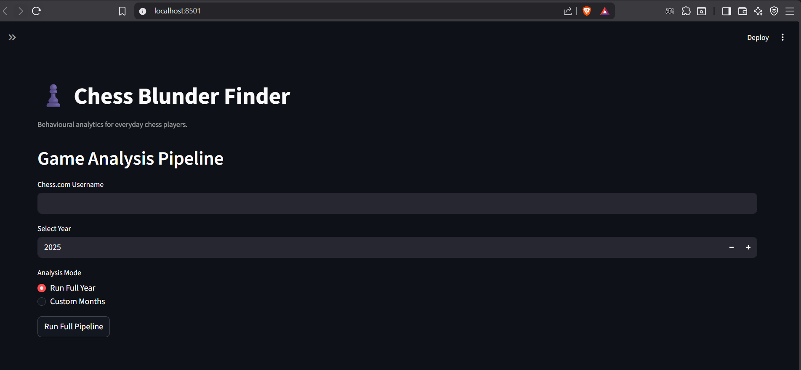

# Chess Blunder Finder

## Project Overview

Chess Blunder Finder is a behavioural analytics tool that analyzes chess games to detect recurring mistakes and tactical weaknesses.

Most chess analysis tools evaluate **individual games**.  
This project analyzes **many games over time** to reveal patterns in how a player actually loses games.

The goal is not to train professional chess players.  
Instead, it helps everyday players understand their **own behaviour on the board** so they can improve gradually without relearning chess from scratch.

For many hobby players, chess is like the gym for the mind — a way to train thinking and discipline.  
By identifying patterns such as repeated blunders or missed tactics, players can become more conscious of their habits and make steady improvements.

---

## Project Highlights

• Built a behavioural analytics pipeline that analyzes chess games to detect recurring player weaknesses.

• Fetches games directly from the Chess.com public API.

• Uses the Stockfish engine to evaluate every move and detect inaccuracies, mistakes, and blunders.

• Detects tactical motifs such as forks, pins, skewers, and traps using board-state analysis.

• Aggregates move-level evaluations into player-level behavioural insights.

• Generates structured outputs (CSV and JSON) suitable for dashboards and further analysis.

• Includes a Streamlit interface allowing users to analyze a player’s games by year or selected months.

---

## System Architecture

Chess.com API  
↓  
PGN Fetcher  
↓  
Stockfish Engine Analysis  
↓  
Tactical Motif Detection  
↓  
Insight Engine  
↓  
Streamlit Application  
↓  
CSV / JSON Output  
↓  
Power BI Dashboards (planned)

---

## Tech Stack

- Python
- Pandas
- python-chess
- Stockfish Engine
- Chess.com API
- Streamlit

---

## How to Run

### Install dependencies

pip install -r requirements.txt

### Run the application

streamlit run src/main.py

Then open the browser and enter:

• Chess.com username  
• Year  
• Months to analyze

---

## Output Data

The system generates datasets in the project folders:

Deep analysis data  

data/deep_analysis/

Tactical motif detection  

data/motifs/

Generated insights  

data/insights/

Monthly results  

outputs/{username}/{year}/{month}

---

## Example Insight

Example output generated by the system:

You often blunder in the middlegame with fork.  
You often blunder in the endgame with trap.  
You often mistake in the opening with fork.

---

## Application Interface

---

## Future Improvements

- Aggregated yearly insights
- Game-type analysis (Blitz / Rapid / Bullet)
- Summary statistics (average blunders, mistakes, inaccuracies)
- Docker containerization
- Cloud deployment
- Automated dashboards
- Player comparison analytics